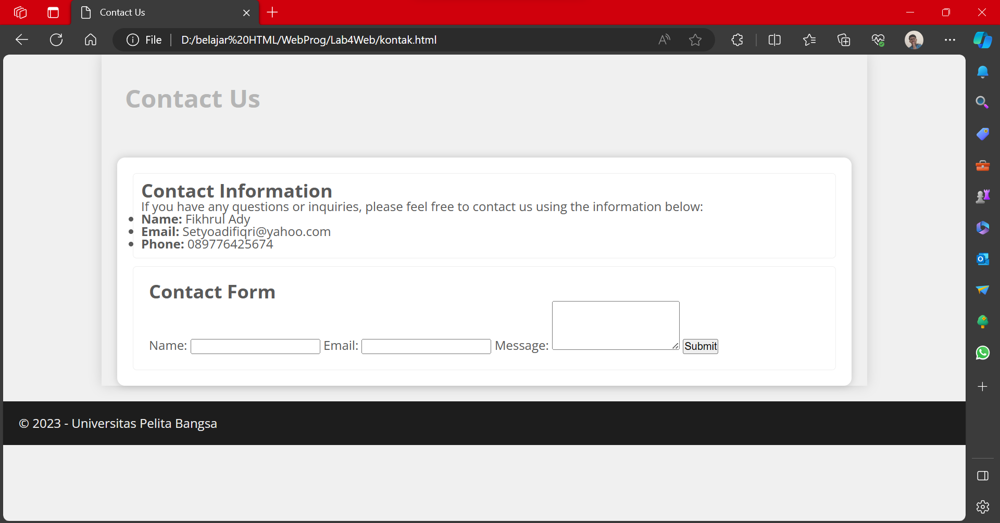

# Lab4_Web 
|**Nama**|**NIM**|**Kelas**|**Matkul**|
|----|---|-----|------|
|Muhammad Fiqri Setyoadi|312210062|TI.22.A.2|Pemograman Web|

## Sediakan Editor Kesayangan kita

## Box Element

## Mengatur Clearfix Element

- Contoh Property Lainnya:
    - ``both``
    
    - ``Right``
    
## Layout Sederhana

## Menambahkan CSS Untuk membuat Layout Sederhana

## Membuat Navigasi

## Membuat Hero Panel

## Mengatur Layout Main dan Sidebar

## Membuat Sidebar Widget

## Mengatur Footer

## Menambahkan Element lainnya pada Main Content

## Menambahkan Content Artikel

## Pertanyaan dan Tugas
1. Tambahkan Layout untuk menu About.

    untuk melihat code klik disini [HTML](code/About.html)

2. Tambahkan layout untuk menu Contact.

    untuk melihat code klik disini [HTML](code/kontak.html)

